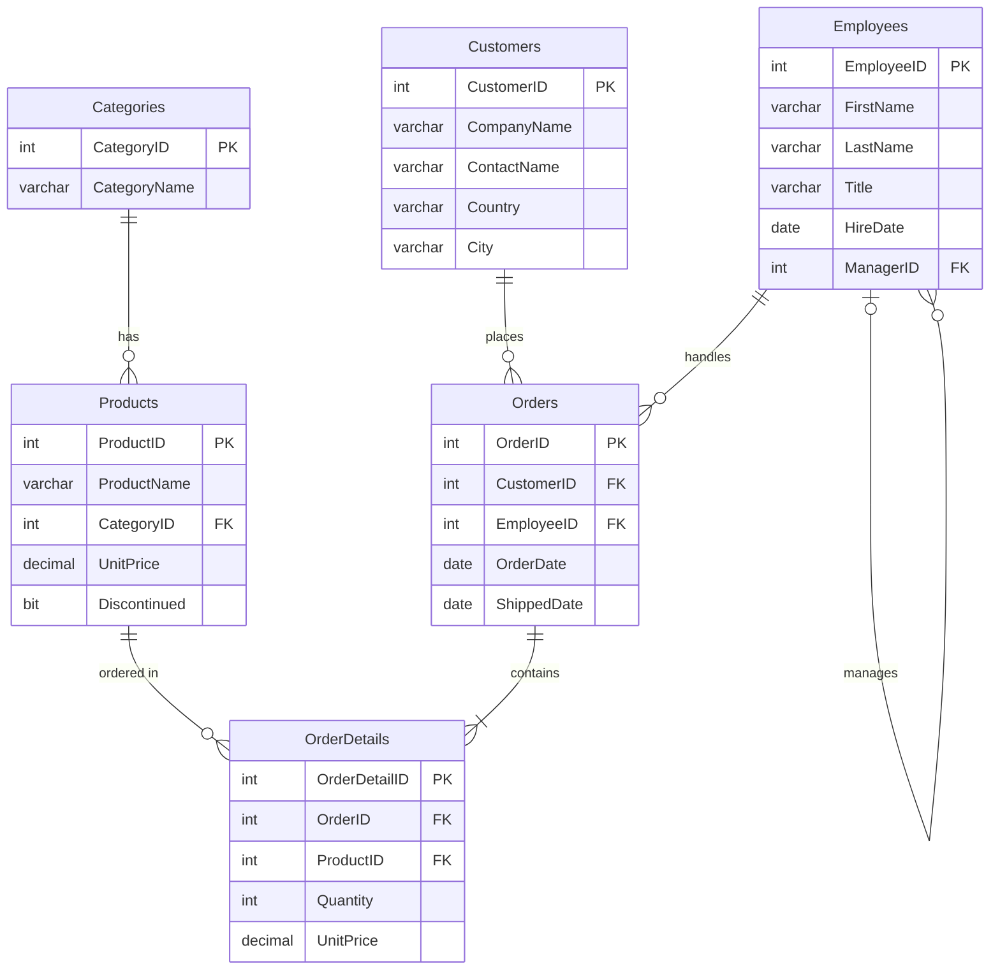

# SQL Practice
T-SQL (SQL Server) practice. 

**[practice.sql](practice.sql)** Link to Master List

```mermaid
erDiagram
    Categories ||--o{ Products : has
    Products ||--o{ OrderDetails : "ordered in"
    Orders ||--|{ OrderDetails : contains
    Customers ||--o{ Orders : places
    Employees ||--o{ Orders : handles
    Employees |o--o{ Employees : manages

    Categories {
        int CategoryID PK
        varchar CategoryName
    }
    Products {
        int ProductID PK
        varchar ProductName
        int CategoryID FK
        decimal UnitPrice
        bit Discontinued
    }
    Customers {
        int CustomerID PK
        varchar CompanyName
        varchar ContactName
        varchar Country
        varchar City
    }
    Employees {
        int EmployeeID PK
        varchar FirstName
        varchar LastName
        varchar Title
        date HireDate
        int ManagerID FK
    }
    Orders {
        int OrderID PK
        int CustomerID FK
        int EmployeeID FK
        date OrderDate
        date ShippedDate
    }
    OrderDetails {
        int OrderDetailID PK
        int OrderID FK
        int ProductID FK
        int Quantity
        decimal UnitPrice
    }
```
